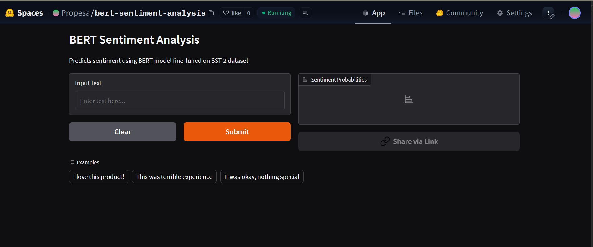

Here's a comprehensive `README.md` file for your project with the deployed link and space for an image:

```markdown
# BERT Sentiment Analysis Web App

[](https://huggingface.co/spaces/Propesa/bert-sentiment-analysis)
[](https://opensource.org/licenses/MIT)

A Gradio web application for sentiment analysis using a fine-tuned BERT model.

 <!-- Replace with your actual image file -->

## 🔍 Overview

This application uses a BERT model (`textattack/bert-base-uncased-SST-2`) fine-tuned on the Stanford Sentiment Treebank (SST-2) dataset to predict whether text input is positive or negative.

## 🚀 Live Demo
[](https://huggingface.co/spaces/Propesa/bert-sentiment-analysis)

## 🛠️ Features

- Real-time sentiment analysis
- Displays probability scores for both positive and negative sentiment
- Example texts to quickly test the model
- Simple and intuitive interface

## 💻 How to Run Locally

1. Clone this repository:
   ```bash
   git clone https://huggingface.co/spaces/Propesa/bert-sentiment-analysis
   cd bert-sentiment-analysis
   ```

2. Install dependencies:
   ```bash
   pip install -r requirements.txt
   ```

3. Run the application:
   ```bash
   python app.py
   ```

4. Open your browser to:
   ```
   http://localhost:7860
   ```

## 📦 Dependencies

- Python 3.7+
- PyTorch
- Transformers
- Gradio

Install all required packages:
```bash
pip install torch transformers gradio
```

## 🧠 Model Details

- **Model:** `textattack/bert-base-uncased-SST-2`
- **Task:** Text Classification (Sentiment Analysis)
- **Dataset:** SST-2 (Stanford Sentiment Treebank)
- **Input:** Raw text
- **Output:** 
  - POSITIVE probability
  - NEGATIVE probability

## 📝 Example Usage

```python
from transformers import pipeline
classifier = pipeline("sentiment-analysis", model="textattack/bert-base-uncased-SST-2")
result = classifier("I really enjoy using this application!")
print(result)
```

## 📜 License

This project is licensed under the MIT License - see the [LICENSE](LICENSE) file for details.

## 🙏 Acknowledgments

- Hugging Face for the Transformers library
- TextAttack for the fine-tuned model
- Stanford NLP for the SST-2 dataset
```

### Image Instructions:
1. Add a screenshot named `app-screenshot.png` to your repository
2. The image will automatically display in the README
3. For best results, use a screenshot of your app in action (800x600px recommended)

### To add this README:
1. Create a new file named `README.md` in your repository
2. Paste the above content
3. Commit and push to your Hugging Face Space

The badge at the top will automatically link to your deployed Space, and the image reference will display your screenshot once you add it to the repository.